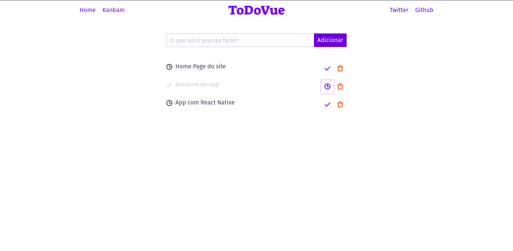

# TODO List Vue.js App

This is a simple Todo List app created with [Vue.js](http://vuejs.org).




## How to run this project? 🤔

### Project setup
```
yarn
```

### Compiles and hot-reloads for development
```
yarn serve
```

### To run in docker container user

```
yarn serve:docker
```

### Compiles and minifies for production
```
yarn build
```

### Lints and fixes files
```
yarn lint
```
## 💻 Technologies

- [x] Javascript;
- [x] [Vue.js](https://vuejs.org);
- [x] [Spectre.css](https://picturepan2.github.io/spectre);


Make with ❤️ by [Kelvyn Santana](http://linkedin.com/in/kelvynsantana)

